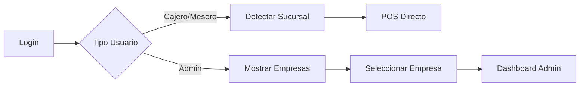

# 🍽️ NathBit POS - Sistema Multi-Sucursal para Restaurantes

Sistema de punto de venta (POS) moderno y robusto diseñado para cadenas de restaurantes con múltiples sucursales, donde cada sucursal opera de forma independiente pero bajo una gestión centralizada.

## 📋 Descripción

NathBit POS es una solución integral que permite:
- 🏪 Gestión multi-empresa y multi-sucursal
- 📊 Control de inventarios por sucursal
- 💰 Sistema de punto de venta ágil
- 🧾 Integración con facturación electrónica (Hacienda CR)
- 👥 Gestión centralizada de empleados
- 📈 Reportes consolidados y por sucursal
- 🪑 Control de mesas y zonas
- 📱 API REST para integraciones

## 🏗️ Arquitectura Multi-Tenant

### **Conceptos Clave**
- **Tenant = Sucursal**: Cada sucursal es un schema independiente en PostgreSQL
- **Usuarios Globales**: Todos los usuarios se gestionan centralmente en el schema `public`
- **Acceso Basado en Roles**: Los usuarios acceden a las sucursales según sus permisos asignados

### **Estructura de Base de Datos**

```
PostgreSQL Database
├── public (schema compartido)
│   ├── usuarios_global        # Todos los usuarios del sistema
│   ├── empresas              # Catálogo de empresas
│   ├── empresas_sucursales   # Relación empresa-sucursal
│   ├── usuario_empresas      # Accesos usuario-empresa
│   ├── usuario_sucursales    # Permisos por sucursal
│   └── configuracion_sistema # Configuración global
│
├── sucursal_001 (tenant schema)
│   ├── productos            # Catálogo local
│   ├── ordenes             # Ventas
│   ├── mesas               # Configuración de mesas
│   ├── cajas               # Terminales POS
│   └── inventario          # Stock local
│
└── sucursal_002 (tenant schema)
    └── ... (misma estructura)
```

## 🚀 Tecnologías

- **Backend Framework**: Java 17 + Spring Boot 3.5.4
- **Base de Datos**: PostgreSQL 14+ (Multi-tenant por schema)
- **Seguridad**: Spring Security + JWT
- **Migraciones**: Flyway
- **Mapeo**: MapStruct
- **Documentación API**: OpenAPI/Swagger
- **Cache**: Spring Cache
- **Build Tool**: Gradle

## 👥 Roles y Permisos

| Rol | Alcance | Descripción | Acceso |
|-----|---------|-------------|--------|
| **ROOT** | Sistema | Desarrollador con acceso total | Todos los tenants |
| **SUPER_ADMIN** | Empresa | Dueño/Administrador principal | Todas las sucursales de sus empresas |
| **ADMIN** | Configurado | Administrador con permisos variables | Según lo configure SUPER_ADMIN |
| **JEFE_CAJAS** | Sucursal | Supervisor de cajas | Una o más sucursales asignadas |
| **CAJERO** | Sucursal | Operador de punto de venta | Sucursal específica |
| **MESERO** | Sucursal | Toma pedidos y gestiona mesas | Sucursal específica |

## 🔐 Flujo de Autenticación

### **1. Login Unificado**
```
URL: https://pos.miempresa.com
```

### **2. Detección Inteligente**

**Para Operativos (Cajero/Mesero):**
- Login con email/password
- Sistema detecta sucursal automáticamente (por IP o asignación)
- Acceso directo al POS sin selectores

**Para Administrativos (Admin/Super Admin):**
- Login con email/password
- Muestra selector de empresas disponibles
- Selecciona empresa → Ve sucursales permitidas
- Puede cambiar entre sucursales sin nuevo login

### **3. Ejemplo de Flujo**



## 🛠️ Instalación

### **Prerequisitos**
- Java 17+
- PostgreSQL 14+
- Git

### **1. Clonar Repositorio**
```bash
git clone https://github.com/tuempresa/nathbit-pos.git
cd nathbit-pos
```

### **2. Configurar Base de Datos**
```sql
-- Crear base de datos
CREATE DATABASE nathbitpos_dev;

-- El sistema creará los schemas automáticamente
```

### **3. Variables de Entorno**
```bash
# Copiar archivo de ejemplo
cp .env.example .env

# Editar con tus valores
DB_HOST=localhost
DB_PORT=5432
DB_NAME=nathbitpos_dev
DB_USER=postgres
DB_PASSWORD=tu_password
JWT_SECRET=genera_una_clave_segura_aqui
```

### **4. Ejecutar Migraciones**
```bash
# Las migraciones se ejecutan automáticamente al iniciar
# O manualmente con:
./gradlew flywayMigrate
```

### **5. Iniciar Aplicación**
```bash
# Desarrollo
./gradlew bootRun

# Producción
./gradlew build
java -jar build/libs/nathbitpos-0.0.1-SNAPSHOT.jar
```

## 📚 Documentación API

Una vez iniciado, accede a:
- **Swagger UI**: `http://localhost:8080/api/swagger-ui.html`
- **OpenAPI JSON**: `http://localhost:8080/api/v3/api-docs`

### **Endpoints Principales**

```
POST   /api/auth/login              # Login unificado
POST   /api/auth/select-context     # Seleccionar empresa/sucursal
POST   /api/auth/refresh            # Renovar token
POST   /api/auth/logout             # Cerrar sesión

GET    /api/usuarios/me             # Perfil del usuario actual
GET    /api/empresas                # Empresas disponibles
GET    /api/sucursales              # Sucursales accesibles

# Endpoints operativos (requieren tenant)
GET    /api/productos               # Catálogo de productos
POST   /api/ordenes                 # Crear orden
GET    /api/mesas                   # Estado de mesas
POST   /api/caja/abrir              # Abrir caja
```

## 🔧 Estructura del Proyecto

```
src/main/java/com/snnsoluciones/nathbitpos/
├── config/
│   ├── security/          # JWT, Spring Security
│   ├── tenant/           # Multi-tenant config
│   └── database/         # Datasource, Flyway
├── controller/
│   ├── auth/            # Autenticación
│   ├── admin/           # Administración
│   └── pos/             # Operaciones POS
├── service/
│   ├── auth/            # Lógica de autenticación
│   ├── tenant/          # Gestión de tenants
│   └── business/        # Lógica de negocio
├── repository/
│   ├── global/          # Repos schema public
│   └── tenant/          # Repos multi-tenant
├── entity/
│   ├── global/          # Entidades globales
│   ├── tenant/          # Entidades por tenant
│   └── base/            # Clases base
├── dto/                 # Objetos de transferencia
├── mapper/              # MapStruct mappers
├── exception/           # Manejo de errores
└── util/               # Utilidades

src/main/resources/
├── db/migration/
│   ├── public/         # Migraciones schema public
│   └── tenant/         # Migraciones por tenant
├── application.yml     # Configuración principal
└── logback-spring.xml  # Configuración de logs
```

## 🎯 Casos de Uso

### **1. María - Cajera en Sucursal Cartago**
- Abre `pos.miempresa.com`
- Ingresa sus credenciales
- El sistema detecta que está en Cartago (por IP)
- Accede directamente al POS de Cartago
- No ve opciones de otras sucursales

### **2. Juan - Administrador Regional**
- Abre `pos.miempresa.com`
- Ingresa sus credenciales
- Ve lista de empresas donde tiene acceso
- Selecciona "Restaurantes del Este"
- Ve dashboard con todas las sucursales
- Puede cambiar entre sucursales sin relogin

### **3. Ana - Super Admin de la Cadena**
- Accede desde cualquier ubicación
- Ve todas las empresas del sistema
- Gestiona usuarios globalmente
- Configura permisos por empresa/sucursal
- Accede a reportes consolidados

## 🔒 Seguridad

- **Autenticación JWT**: Tokens seguros con expiración
- **Bcrypt**: Encriptación de contraseñas
- **Rate Limiting**: Prevención de ataques de fuerza bruta
- **Auditoría**: Registro de todas las operaciones críticas
- **Control de IP**: Restricción por ubicación para roles operativos
- **HTTPS**: Obligatorio en producción

## 📈 Características Principales

### **Gestión de Productos**
- Catálogo por sucursal
- Precios diferenciados
- Control de inventario
- Modificadores y combos

### **Punto de Venta**
- Interface rápida y simple
- Múltiples formas de pago
- Descuentos y promociones
- Impresión de tickets

### **Control de Mesas**
- Mapa visual de mesas
- Estados en tiempo real
- Transferencia entre meseros
- Cuentas divididas

### **Reportes**
- Ventas por período
- Productos más vendidos
- Performance por empleado
- Cierre de caja detallado

### **Integración Factura Electrónica**
- Conexión asíncrona con API externa
- Reintento automático
- Almacenamiento de respuestas
- Envío de correos automático

## 🚧 Roadmap

- [x] Sistema multi-tenant base
- [x] Autenticación y autorización
- [x] Gestión de usuarios global
- [ ] Módulo completo de productos
- [ ] Sistema de órdenes y ventas
- [ ] Control de inventario
- [ ] Reportes básicos
- [ ] App móvil para meseros
- [ ] Dashboard analytics
- [ ] Integración con sistemas contables

## 🤝 Contribuir

1. Fork el proyecto
2. Crea tu rama (`git checkout -b feature/NuevaCaracteristica`)
3. Commit cambios (`git commit -m 'Agrega nueva característica'`)
4. Push a la rama (`git push origin feature/NuevaCaracteristica`)
5. Abre un Pull Request

### **Estándares de Código**
- Usar formateo de Google Java Style
- Escribir tests para nueva funcionalidad
- Documentar métodos públicos
- Mensajes de commit en español

## 📄 Licencia

Copyright © 2025 SNN Soluciones. Todos los derechos reservados.

Este es software propietario. No se permite su distribución sin autorización.

## 📞 Contacto

**SNN Soluciones**
- Web: [https://snnsoluciones.com](https://snnsoluciones.com)
- Email: soporte@snnsoluciones.com
- Tel: +506 2234-5678

## 🙏 Agradecimientos

- Equipo de desarrollo de SNN Soluciones
- Comunidad Spring Boot
- Colaboradores del proyecto

---

Desarrollado con ❤️ por SNN Soluciones en Costa Rica 🇨🇷