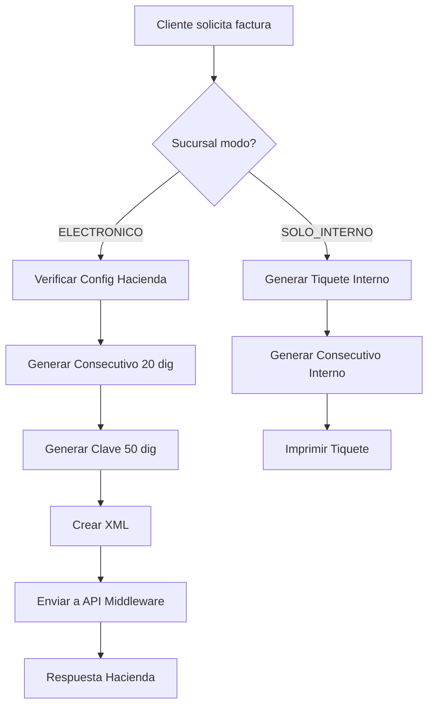

# 📋 GUÍA DE CONTROL DE FACTURACIÓN - NATHBIT POS

## 🎯 OBJETIVO
Esta guía detalla la lógica completa de facturación, incluyendo la generación de consecutivos, formación de claves y el flujo de emisión de documentos tanto electrónicos como internos.

## 🔢 SISTEMA DE NUMERACIÓN

### 1. **CONSECUTIVO (20 DÍGITOS)**

#### Estructura:
```
[SUCURSAL] + [TERMINAL] + [TIPO_DOC] + [CONSECUTIVO]
    003         00005         01        0000000157
    ↓            ↓            ↓              ↓
  3 dígitos   5 dígitos   2 dígitos    10 dígitos
```

#### Componentes:

**A) Sucursal (3 dígitos)**
- `001` = Casa matriz/Principal
- `002` = Primera sucursal
- `003` = Segunda sucursal
- Se genera automáticamente al crear sucursal
- Editable manualmente si es necesario

**B) Terminal/Caja (5 dígitos)**
- `00001` = Primera caja
- `00002` = Segunda caja
- Máximo 2 terminales por sucursal
- Se asigna al abrir sesión de caja

**C) Tipo de Documento (2 dígitos)**
- `01` = Factura Electrónica
- `04` = Tiquete Electrónico
- `TI` = Tiquete Interno (no Hacienda)
- `FI` = Factura Interna (no Hacienda)

**D) Número Consecutivo (10 dígitos)**
- Inicia en `0000000001`
- Incrementa por cada documento
- **Independiente por terminal**
- Puede reiniciar al llegar al límite

#### Ejemplo Real:
```
Sucursal: San Pedro (003)
Terminal: Caja 2 (00002)
Documento: Factura Electrónica (01)
Consecutivo: 523

Resultado: 00300002010000000523
```

### 2. **CLAVE NUMÉRICA (50 DÍGITOS)**

#### Estructura Completa:
```
[PAÍS] + [FECHA] + [IDENTIFICACIÓN] + [CONSECUTIVO] + [SITUACIÓN] + [SEGURIDAD]
  506    09082025   123456789012    00300002010000000523      1        87654321
   ↓        ↓            ↓                   ↓                 ↓           ↓
3 dígitos 8 dígitos  12 dígitos         20 dígitos         1 dígito   8 dígitos
```

#### Desglose de Componentes:

**1. País (3 dígitos)**
- Siempre `506` para Costa Rica

**2. Fecha (8 dígitos)**
- Formato: DDMMAAAA
- `09082025` = 9 de agosto de 2025

**3. Identificación Emisor (12 dígitos)**
- Cédula física: 9 dígitos + 3 ceros al inicio
- Cédula jurídica: 10 dígitos + 2 ceros al inicio
- DIMEX: 11-12 dígitos + ceros si necesario
- Ejemplo: `003101123456` (jurídica)

**4. Consecutivo (20 dígitos)**
- El mismo generado anteriormente

**5. Situación (1 dígito)**
- `1` = Normal (envío inmediato)
- `2` = Contingencia (sin sistema Hacienda)
- `3` = Sin internet

**6. Código Seguridad (8 dígitos)**
- Generado por algoritmo
- Últimos 4 del timestamp + hash(ID)

## 💼 FLUJO DE FACTURACIÓN

### 1. **DECISIÓN INICIAL**
```java
if (sucursal.getModoFacturacion() == ELECTRONICO) {
    // Mostrar opciones electrónicas
    if (empresa.getRequiereHacienda() && configHacienda.isCompleta()) {
        // Proceder con factura electrónica
    } else {
        throw new Exception("Configuración Hacienda incompleta");
    }
} else {
    // Solo documentos internos
    // No requiere clave de 50 dígitos
}
```

### 2. **GENERACIÓN DE CONSECUTIVO**

```java
// En TerminalService
public String generarConsecutivo(Long terminalId, TipoDocumento tipo) {
    Terminal terminal = findById(terminalId);
    Sucursal sucursal = terminal.getSucursal();
    
    // Obtener siguiente número
    Long siguiente = terminal.incrementarConsecutivo(tipo.getCodigo());
    
    // Formar consecutivo de 20 dígitos
    return sucursal.getNumeroSucursal() +           // 001
           terminal.getNumeroTerminal() +            // 00001
           tipo.getCodigo() +                        // 01
           String.format("%010d", siguiente);        // 0000000523
}
```

### 3. **GENERACIÓN DE CLAVE**

```java
public String generarClave(Documento documento) {
    // Componentes
    String pais = "506";
    String fecha = formatearFecha(documento.getFecha()); // DDMMAA
    String identificacion = formatearIdentificacion(
        empresa.getTipoIdentificacion(),
        empresa.getIdentificacion()
    );
    String consecutivo = documento.getConsecutivo(); // 20 dígitos
    String situacion = documento.getSituacion();     // 1, 2 o 3
    String seguridad = generarCodigoSeguridad(documento.getId());
    
    return pais + fecha + identificacion + consecutivo + situacion + seguridad;
}

private String generarCodigoSeguridad(Long documentoId) {
    String timestamp = String.valueOf(System.currentTimeMillis());
    String ultimos4 = timestamp.substring(timestamp.length() - 4);
    
    int hash = (documentoId.hashCode() + 12345) % 10000;
    String hash4 = String.format("%04d", Math.abs(hash));
    
    return ultimos4 + hash4; // 8 dígitos
}
```

## 📊 CASOS DE USO

### CASO 1: Factura Electrónica
```
Empresa: Supermercado La Economía
Identificación: 3-101-123456 (jurídica)
Sucursal: Cartago Centro (002)
Terminal: Caja 1 (00001)
Fecha: 09/08/2025
Documento: Factura Electrónica
Consecutivo actual: 1,523

CONSECUTIVO: 00200001010000001524
CLAVE: 50609082500310112345600200001010000001524112345678
```

### CASO 2: Tiquete Interno
```
Empresa: Pulpería Don Juan
Sucursal: Única (001)
Terminal: Caja única (00001)
Modo: SOLO_INTERNO

CONSECUTIVO: 001000001TI0000000045
CLAVE: No se genera (no va a Hacienda)
```

## 🔒 VALIDACIONES IMPORTANTES

### 1. **Antes de Facturar Electrónicamente**
- ✓ Empresa.requiereHacienda = true
- ✓ ConfigHacienda completa
- ✓ Sucursal.modoFacturacion = ELECTRONICO
- ✓ Sesión de caja abierta
- ✓ Terminal asignada

### 2. **Control de Consecutivos**
- Cada terminal maneja sus propios consecutivos
- No hay colisión entre terminales
- Alerta al acercarse al límite (9,999,999,000)
- Error al alcanzar límite (9,999,999,999)

### 3. **Tipos de Situación**
- **Normal (1)**: Envío inmediato a Hacienda
- **Contingencia (2)**: Sistema Hacienda caído
- **Sin Internet (3)**: Guardar y enviar después

## 🔄 FLUJO COMPLETO DE EMISIÓN



## 💾 ALMACENAMIENTO

### Tabla: documentos_emitidos
```sql
CREATE TABLE documentos_emitidos (
    id BIGINT PRIMARY KEY,
    consecutivo VARCHAR(20) NOT NULL,
    clave VARCHAR(50),  -- NULL para internos
    tipo_documento VARCHAR(2),
    terminal_id BIGINT,
    sesion_caja_id BIGINT,
    fecha_emision TIMESTAMP,
    situacion CHAR(1),
    estado_hacienda VARCHAR(20),
    xml_enviado TEXT,
    xml_respuesta TEXT,
    UNIQUE(consecutivo)
);
```

## 🚨 MANEJO DE ERRORES

### 1. **Consecutivo Agotado**
```java
if (consecutivo >= 9999999999L) {
    // Notificar administrador
    // Bloquear terminal para ese tipo de documento
    // Sugerir crear nueva sucursal o terminal
}
```

### 2. **Sin Conexión a Hacienda**
```java
try {
    enviarHacienda(documento);
} catch (ConexionException e) {
    documento.setSituacion("3"); // Sin internet
    guardarPendiente(documento);
    // Reintentar automáticamente cada 5 minutos
}
```

## 📝 NOTAS FINALES

1. **Consecutivos son únicos** por la combinación sucursal+terminal+tipo
2. **La clave es única** por incluir fecha+hora+código seguridad
3. **Documentos internos** no requieren clave de 50 dígitos
4. **Régimen simplificado** SÍ puede emitir electrónicamente
5. **API Middleware** maneja conversión JSON→XML y firma digital

---

*Esta guía es parte del sistema NathBit POS v1.0*